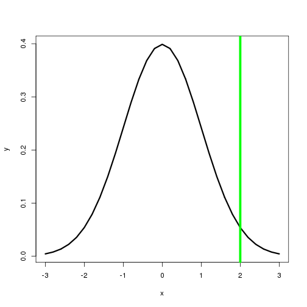
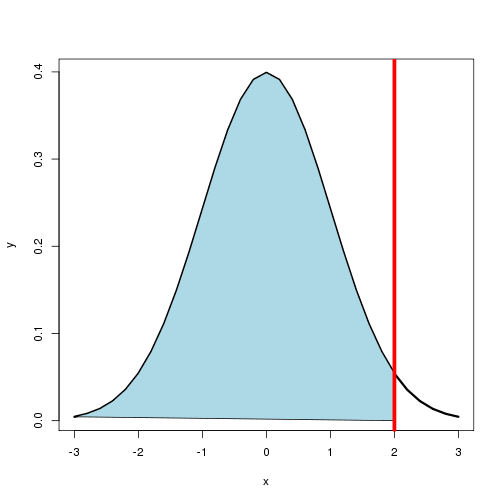
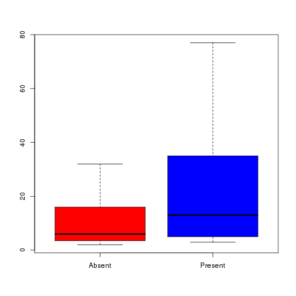
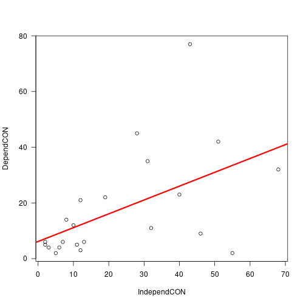
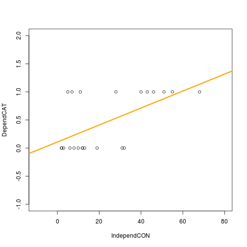
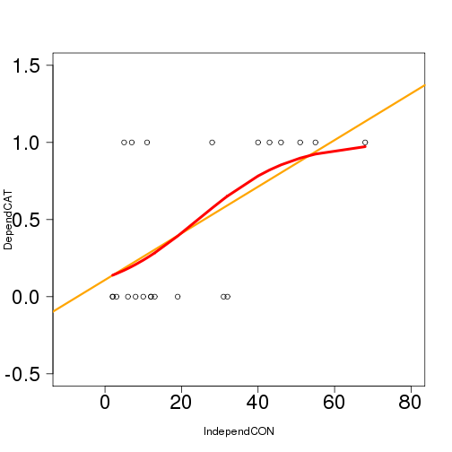

4 Statistical Frameworks
========================================================
author: Marc Los Huertos
date: Sept. 17, 2016
autosize: true

Science and Method
=======================================================

What is the Scientific Method?
- Make Observations
- Articulate Hypothesis
- Collect Data
- Confront Hypothesis with Data (or Confront Data with Models)
- Interpret Results
- Create New Hypotheses

How do we confront a hypothesis?
========================================================

There are several methods -- We will begin with the popular "frequentists" approach:

Articulate a Null hypothesis (expectation if patterns don't exists, if processes are random...); where altnerative hypothesis suggest a pattern that is non-random.

Test the Null. If we reject, then it leads to....??

An Example of a Null Hypothesis
=======================================================


```r
set.seed(123)
randomdata <-round(rnorm(10, 0, 1), 1); randomdata
```

```
 [1] -0.6 -0.2  1.6  0.1  0.1  1.7  0.5 -1.3 -0.7 -0.4
```

```r
hist(randomdata)
```


Question: Is a value >=2 within the random variation?  

Assuming a Probability Distrbution
=================================================

```r
set.seed(123)
x <- seq(-3, 3, .2)
y <- dnorm(x, 0, 1)
plot(x,y, type="l", lwd=3)
abline(v=2, col="green", lwd=5)
```



asdfasd
=================================================


```r
plot(x,y, type="l", lwd=3)
abline(v=2, col="green", lwd=5)
x1 <- x[x <= 2]
y1 <- dnorm(x1, 0, 1)
polygon(x=c(x1), y=(y1), col="gray")
```



The gray area has 0.98, so the ungrayed has an area of 0.02. Is this a statistical rarity? 


"The Matrix" of Variable Types
========================================================

- Predictors -- Categorical OR Continuous
- Response -- Categorical OR Continusous

Creating Some Vectors
========================================================


```r
IndependCAT =c(0, 1, 0, 0, 1, 0, 0, 1, 1, 1, 1, 1, 1, 1, 0, 0, 0, 0, 0, 0, 1, 1)
DependCAT =   c(T,  F, F, F, F, F, T,  F,  T,  F,  T,  F,  T,  F, T,  F, F, F, T, T, F, T)
IndependCON = c(55, 3, 5, 2, 7, 8, 43, 12, 51, 10, 30, 31, 43, 6, 11, 2, 9, 13, 44, 32, 8, 55)
DependCON = c(2, 4, 2, 5, 6, 14, 23, 21, 42, 12, 45, 35, 77, 4, 5, 6, 3, 6, 9, 11, 22, 32)
```

Converting 1s and 0s to Absent and Present
========================================================


```r
IndependCAT2 <- NULL
IndependCAT2[IndependCAT==0] <- "Absent"
IndependCAT2[IndependCAT==1] <- "Present"
IndependCAT2
```

```
 [1] "Absent"  "Present" "Absent"  "Absent"  "Present" "Absent"  "Absent" 
 [8] "Present" "Present" "Present" "Present" "Present" "Present" "Present"
[15] "Absent"  "Absent"  "Absent"  "Absent"  "Absent"  "Absent"  "Present"
[22] "Present"
```
Checking Vectors -- Do each have the same length?
========================================================


```r
length(DependCAT)
```

```
[1] 22
```

```r
length(DependCON)
```

```
[1] 22
```

```r
length(IndependCAT)
```

```
[1] 22
```

```r
length(IndependCON)
```

```
[1] 22
```

```r
length(IndependCAT2)
```

```
[1] 22
```


Yup!

Predictor = Categorical, Response = Categorical
=======================================================

```
         IndependCAT2
DependCAT Absent Present
    FALSE      6       7
    TRUE       5       4
```

```

	Pearson's Chi-squared test with Yates' continuity correction

data:  DependCAT and IndependCAT2
X-squared = 0, df = 1, p-value = 1
```

Predictor = Categorical, Response = Continuous 
======================================================
left: 30%

```r
boxplot(DependCON ~ IndependCAT2, col=c("red", "blue"))
```


***

```r
t.test(DependCON ~ IndependCAT2)
```

```

	Welch Two Sample t-test

data:  DependCON by IndependCAT2
t = -2.7985, df = 11.589, p-value = 0.01656
alternative hypothesis: true difference in means is not equal to 0
95 percent confidence interval:
 -34.660668  -4.248423
sample estimates:
 mean in group Absent mean in group Present 
             7.818182             27.272727 
```

Predictor = Continuous, Response = Continuous 
======================================================
left: 35%

***

```r
summary(lm(DependCON ~ IndependCON))
```

```

Call:
lm(formula = DependCON ~ IndependCON)

Residuals:
    Min      1Q  Median      3Q     Max 
-33.099  -6.779  -3.345   7.427  48.249 

Coefficients:
            Estimate Std. Error t value Pr(>|t|)  
(Intercept)   6.0034     5.3484   1.122   0.2750  
IndependCON   0.5290     0.1868   2.832   0.0103 *
---
Signif. codes:  0 '***' 0.001 '**' 0.01 '*' 0.05 '.' 0.1 ' ' 1

Residual standard error: 16.25 on 20 degrees of freedom
Multiple R-squared:  0.2863,	Adjusted R-squared:  0.2506 
F-statistic: 8.022 on 1 and 20 DF,  p-value: 0.01029
```

Predictor = Continuous, Response = Categorical 
======================================================

Predictor = Continuous, Response = Categorical 
======================================================

```

Call:
glm(formula = DependCAT ~ IndependCON, family = binomial(link = "logit"))

Deviance Residuals: 
    Min       1Q   Median       3Q      Max  
-1.7027  -0.3572  -0.2263   0.2291   2.1519  

Coefficients:
            Estimate Std. Error z value Pr(>|z|)   
(Intercept) -4.07768    1.55327  -2.625  0.00866 **
IndependCON  0.16967    0.06406   2.649  0.00808 **
---
Signif. codes:  0 '***' 0.001 '**' 0.01 '*' 0.05 '.' 0.1 ' ' 1

(Dispersion parameter for binomial family taken to be 1)

    Null deviance: 29.767  on 21  degrees of freedom
Residual deviance: 10.414  on 20  degrees of freedom
AIC: 14.414

Number of Fisher Scoring iterations: 6
```

Predictor = Continuous, Response = Categorical 
======================================================



