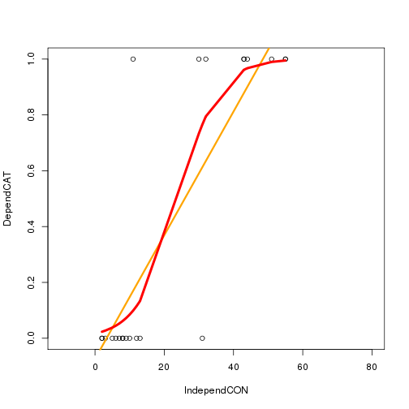

4StatisticalMethods
========================================================
author: 
date: 
autosize: true

"The Matrix" of Variable Types
========================================================

For more details on authoring R presentations please visit <https://support.rstudio.com/hc/en-us/articles/200486468>.

- Predictors -- Categorical OR Continuous
- Response -- Categorical OR Continusous

Creating Some Vectors
========================================================


```r
IndependCAT =c(0, 1, 0, 0, 1, 0, 0, 1, 1, 1, 1, 1, 1, 1, 0, 0, 0, 0, 0, 0, 1, 1)
DependCAT =   c(T,  F, F, F, F, F, T,  F,  T,  F,  T,  F,  T,  F, T,  F, F, F, T, T, F, T)
IndependCON = c(55, 3, 5, 2, 7, 8, 43, 12, 51, 10, 30, 31, 43, 6, 11, 2, 9, 13, 44, 32, 8, 55)
DependCON = c(2, 4, 2, 5, 6, 14, 23, 21, 42, 12, 45, 35, 77, 4, 5, 6, 3, 6, 9, 11, 22, 32)
```


Checking Vectors -- Do each have the same length?
========================================================


```
[1] 22
```

```
[1] 22
```

```
[1] 22
```

```
[1] 22
```

```
[1] 22
```

Yup!

Categorical-Categorical
=======================================================

```r
table.CAT <- table(DependCAT, IndependCAT2); table.CAT
```

```
         IndependCAT2
DependCAT Absent Present
    FALSE      6       7
    TRUE       5       4
```

```r
chisq.test(DependCAT, IndependCAT2)
```

```

	Pearson's Chi-squared test with Yates' continuity correction

data:  DependCAT and IndependCAT2
X-squared = 0, df = 1, p-value = 1
```

Categorical-Predictor, Continuous Response
======================================================
left: 30%

```r
boxplot(DependCON ~ IndependCAT2, col=c("red", "blue"))
```


***

```r
t.test(DependCON ~ IndependCAT2)
```

```

	Welch Two Sample t-test

data:  DependCON by IndependCAT2
t = -2.7985, df = 11.589, p-value = 0.01656
alternative hypothesis: true difference in means is not equal to 0
95 percent confidence interval:
 -34.660668  -4.248423
sample estimates:
 mean in group Absent mean in group Present 
             7.818182             27.272727 
```

Predictor= Continuous, Response = Continuous 
======================================================
left: 30%

```r
plot(DependCON ~ IndependCON, las=1)
abline(coef(lm(DependCON ~ IndependCON)), col="red", lwd=2)
```


***

```r
summary(lm(DependCON ~ IndependCON))
```

```

Call:
lm(formula = DependCON ~ IndependCON)

Residuals:
    Min      1Q  Median      3Q     Max 
-33.099  -6.779  -3.345   7.427  48.249 

Coefficients:
            Estimate Std. Error t value Pr(>|t|)  
(Intercept)   6.0034     5.3484   1.122   0.2750  
IndependCON   0.5290     0.1868   2.832   0.0103 *
---
Signif. codes:  0 '***' 0.001 '**' 0.01 '*' 0.05 '.' 0.1 ' ' 1

Residual standard error: 16.25 on 20 degrees of freedom
Multiple R-squared:  0.2863,	Adjusted R-squared:  0.2506 
F-statistic: 8.022 on 1 and 20 DF,  p-value: 0.01029
```

Predictor = Continuous, Response = Categorical 
======================================================

```r
plot(DependCAT ~ IndependCON, xlim=c(-10,80))
abline(coef(lm(DependCAT ~ IndependCON)), col="orange", lwd=3)
```


Predictor = Continuous, Response = Categorical 
======================================================

```r
glm.out <- glm(DependCAT ~ IndependCON, family=binomial(link='logit'))
summary(glm.out)
```

```

Call:
glm(formula = DependCAT ~ IndependCON, family = binomial(link = "logit"))

Deviance Residuals: 
    Min       1Q   Median       3Q      Max  
-1.7027  -0.3572  -0.2263   0.2291   2.1519  

Coefficients:
            Estimate Std. Error z value Pr(>|z|)   
(Intercept) -4.07768    1.55327  -2.625  0.00866 **
IndependCON  0.16967    0.06406   2.649  0.00808 **
---
Signif. codes:  0 '***' 0.001 '**' 0.01 '*' 0.05 '.' 0.1 ' ' 1

(Dispersion parameter for binomial family taken to be 1)

    Null deviance: 29.767  on 21  degrees of freedom
Residual deviance: 10.414  on 20  degrees of freedom
AIC: 14.414

Number of Fisher Scoring iterations: 6
```

Predictor = Continuous, Response = Categorical 
======================================================

```r
plot(DependCAT ~ IndependCON, xlim=c(-10,80))
abline(coef(lm(DependCAT ~ IndependCON)), col="orange", lwd=3)
lines(sort(IndependCON), sort(glm.out$fitted), type="l", col="red", lwd=4)
```




