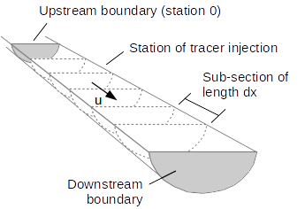

```{r setup, include=FALSE}
knitr::opts_chunk$set(echo = TRUE)
library(knitr)    # For knitting document and include_graphics function
library(ggplot2)  # For plotting
library(png)      # For grabbing the dimensions of png files
```

## Modeling Solute Plumes in Streams

In other word and in many cases, pollutants!

```{r}
source("xecute.r")
```

## Descretized Units

For many in environmental science, calculus was a part of our education, but its application has been rather limited and certainly few need to use much of what they have learned. However, conceptially, any understanding of the topic is really useful!

## The 3D ADR Equation and the 1D Model

We can estimate the change in solute concentration using a differential equation:

$$ \frac{\delta C}{\delta t} = \color{blue}{D_x\frac{\delta^2 C}{\delta x^2} + D_y \frac{\delta^2 C}{\delta y^2} + D_z \frac{\delta^2 C}{\delta z^2}} - \color{red}{\nu \frac{\delta C}{\delta x}} - \lambda RC$$
where C is the concentration and $\frac{\delta C}{\delta t}$ is the change in concentration with time (g/m$^3$/sec). D represents dispersion coefficient, which might differ in the x, y, and z directions, which have units of length$^2$/time, e.g. m$^2$/sec. $\nu$ is a matrix (water) velocity which is only modelled in one direction and $\lambda$ is a decay rate for the solute, which might be interacting with the substrate or matrix to be "retarded", which is modelled with R. 

Now, let's simplify!  Let's forget the solute reaction part and only model in the direction of the stream flow, assuming that we only care about the direction of the stream flow: 


$$ \frac{\delta C}{\delta t} = \color{blue}{D_x\frac{\delta^2 C}{\delta x^2}} - \color{red}{\nu \frac{\delta C}{\delta x}}$$
Now we have a pretty staightforward model!  Note: when we multiple the dimensions of dispersion (m$^2$/sec) by the $\frac{\delta^2 C}{\delta x^2}$ term units (g/m$^3$/m$^2$), we get g/m$^3$/sec... which matches the velocity term units in red and the first term in black!

To actually develop a numerical solution, we descretize the stream in to segments, where each segments is...xyz...




## What is Dispersion and how is it modeled?

The dispersion coefficient in the ADR equation accounts for the combined effects of molecular diffusion and mechanical dispersion, both of which cause spreading of the contaminant plume from highly concentrated areas toward less concentrated areas. 

- Molecular diffusion is the result of the thermal motion of individual molecules which causes a flux of dissolved solutes from areas of higher concentration to areas of lower concentration. 

- Mechanical dispersion (hydrodynamic dispersion) results from groundwater moving at rates that vary from the average linear velocity. Because the invading solute-containing water does not travel at the same velocity everywhere, mixing occurs along flow paths. Typical values of the mechanical dispersivity measured in laboratory column tests are on the order of 0.01 to 1 cm. 

- So-called macrodispersion is also observed, but without a clear mechanism. Let's just call it a fudge factor to better model what has been observed, especially in plumes in groundwater. The maximum predicted dispersivity values are in the range of 0.5 to 5 m is is generally most pronounced near the sources. 

## Adjusting Parameters

For the model run above, the following parameters were modeled: 

```{r, echo=FALSE}
params = data.frame(
  Parameter = c("inputMass", "wetArea", "u", "d", "dx", "nCells", "inputCell", "times"),
  Default_Value = c(inputMass, wetArea, u, d, dx, nCells, inputCell, length(times)),
  Description = c("Solute Mass", "Wet cross-section area", "Advective velocity", 
                  "Longitudinal dispersion coefficient", "Length of sub-section",
                  "Number of cells", "Relative input location", "Number of time-steps modeled"),
       Units = c("g", "m2", "m/s", "m2/s", "m", "NA", "NA", "s"))

kable(params)

```

Using this rblock, adjust the values so you can see the resulting changes:


```{r, newparams}

default_times = times
experimental_times = c(20, 30, 60, 600, 3000, 6000, 10000)

params.new = data.frame(
  Parameter = c("inputMass", "wetArea", "u", "d", "dx", "nCells", "inputCell", "times"),
  Default_Value = params$Default_Value,
  Experiment_Value = c(
    5, # Input Mass
    5, # Wet Area
    .1, # stream velocity
    100, # dispersion coef
    10, # Sub-section length
    100, #dx
    10, #inputcells
    length(experimental_times)
    ))

default_times = times
experimental_times = c(20, 30, 60, 600, 3000, 6000, 10000)
```

#### New Values

```{r, echo=FALSE}
kable(cbind(params[,c(1,2)], params.new[,c(2, 3)], params[,c(3:4)])[,c(1,3,4,5,6)])

inputMass <- params.new$Experiment_Value[params.new$Parameter=="inputMass"]
wetArea <- params.new$Experiment_Value[params.new$Parameter=="wetArea"]
u <- params.new$Experiment_Value[params.new$Parameter=="u"]
d <- params.new$Experiment_Value[params.new$Parameter=="d"]
dx <- params.new$Experiment_Value[params.new$Parameter=="dx"]
ncells <- params.new$Experiment_Value[params.new$Parameter=="ncells"]
inputCell <- params.new$Experiment_Value[params.new$Parameter=="inputCell"]

(times <- experimental_times)
```

```{r, echo=FALSE}
source("xecute2.r")
```


