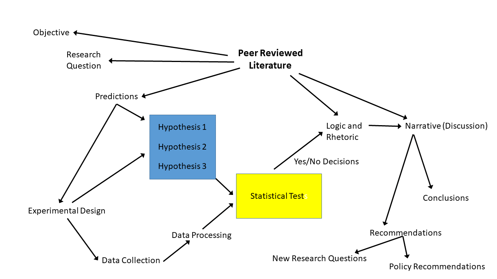
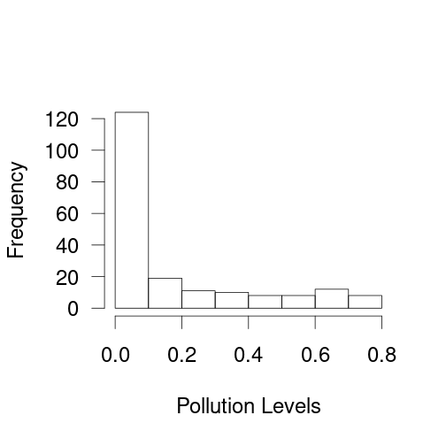
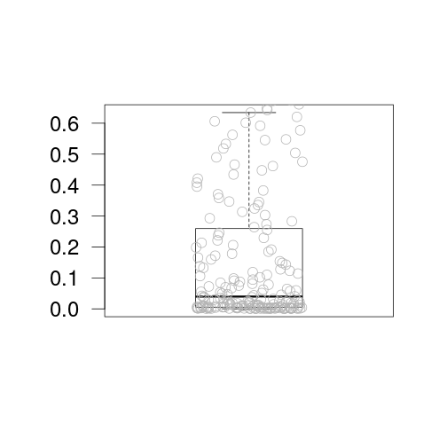
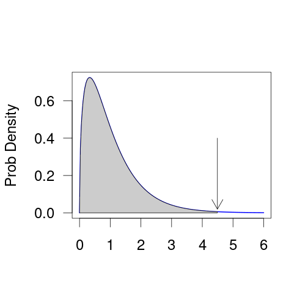
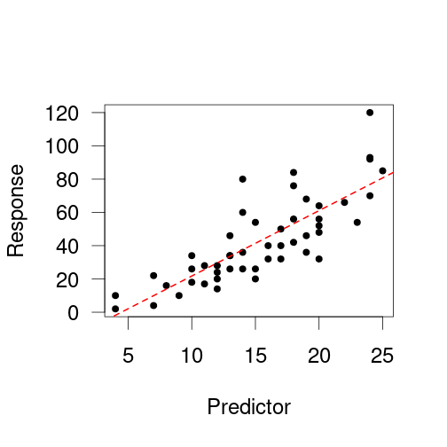
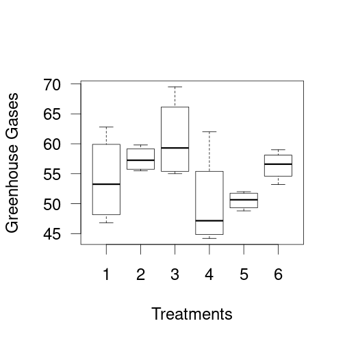
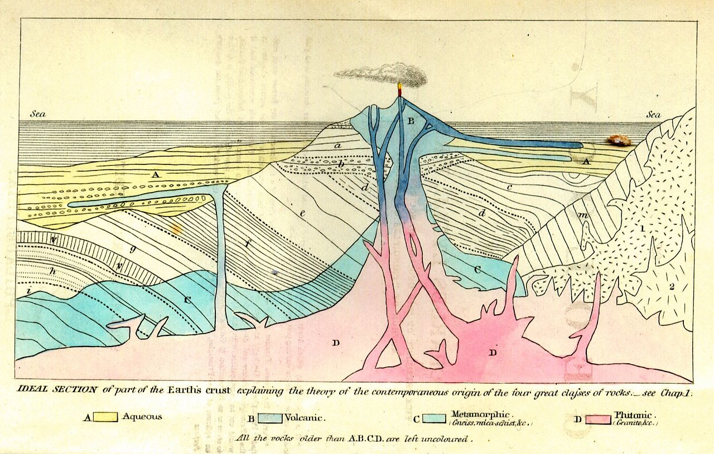
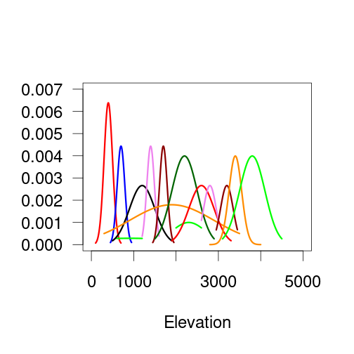
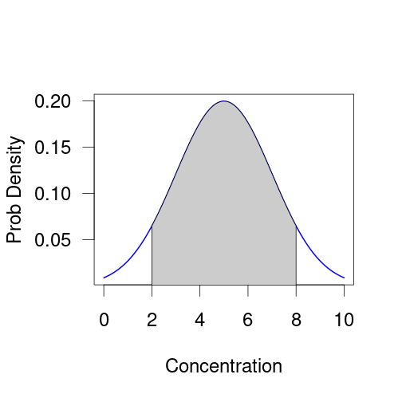

Research Methods in Environmental Science
========================================================
author: Marc Los Huertos
date: Sept. 2020
autosize: true

Tensions within; Science as Pawn; Science with Agency
===================================================

- Science as a Process, uneven progress
- The signal in the noise
- Logic of statistics and conclusions
- Apartheid Ecology
- Ecology as a subversive science


Science as a Process
=========


Signal and Noise
====================================================



When should we be concerned?
***




How do we represent that data?  Median, mean, range, etc?

Using Statistical Distributions -- Often Represents Natural Variation
=====================


***

Predetermined (arbitrary?) Thresholds
p value =  0.0044852

The logic for frequentist statistics -- reject the null hypothesis, i.e. no differences from random processes.


Predictions and Responses: Regression
==================================================


***

Lots of correlations in the world -- but are they casaul?  Perhaps...

e.g., number of members in the Church of England and Infant Mortality Rate... 
Controlled Experiments
===============================


***

Controlled Experiments -- "Gold Standard" in natural science...

```r
summary(aov(yield ~ block, npk))
```

```
            Df Sum Sq Mean Sq F value Pr(>F)  
block        5  343.3   68.66   2.318 0.0861 .
Residuals   18  533.1   29.62                 
---
Signif. codes:  0 '***' 0.001 '**' 0.01 '*' 0.05 '.' 0.1 ' ' 1
```

But has the potential to be unrealistic (and meaningful?)

Conclusions in Science
===============

-- Natural scientists don't really claim "truth", 
-- Instead we make contextual, conditional statments about belief and confidence. 
-- Natural scientists are comfortable with uncertainty.


Forensics as Method, e.g. Geology
=============

- Uniformitarianism.
- Original horizontality.
- Superposition.
- Cross-cutting relationships.

***



We can use "rules" or "principles" to interpret the natural or built environment.

NOTE: Where do we learn these rules/principles?

Ecology and Natural Experiments
=============================


***

--Environmental Gradients allow ecologists to hold things constant to see how the gradient affects the ecosystem. 

--Environmental gradients can included physical factors (elevation, rainfall, etc) or processes (distrubance, herbivory, etc). 

Thresholds and Environmental Quality
=====================

- Is the problem real?
- How can we tell?
- "Middle Bear Problem"

***


Science as Social Method
===============

- Peer Review 
- Reproducibility
- Documentation and Replication
- "In service of society"

Science and Power
===============

What does being in service mean?

- In service of war (colonization, imperialism, capital)
- In service of macro-parasites (senso McNeill)
- Legitamize (rescue) states in crisis, e.g. green revolution
- 

***

Trick of Science -- Claims of Objectivity

- In service of capital
- Post WWII, liberal democracy science
- 1960s breakdown of science hegemony

Politicized Science

- Soviet Science and Lysenko
- Cold War environmental outcomes


======
Thesis - Antithesis -> Synthesis


- Dialectic between liberatory and repressive forces.

-- Ambigous statistical signals and uncertainty 

-- Used for business as usual

- Ecology as a Subversive Science

-- Documents the contradictions of extractive systems

-- Provides paths toward (holistic?) sustainability 

***


Environmental Science for 21st Century Politics
=====

- Acknowledges interlocking systems of oppression
- Based on intersectionality as a condition
- Navigates tensions with integrity
- Negotiates with different ways of knowing/meaning

