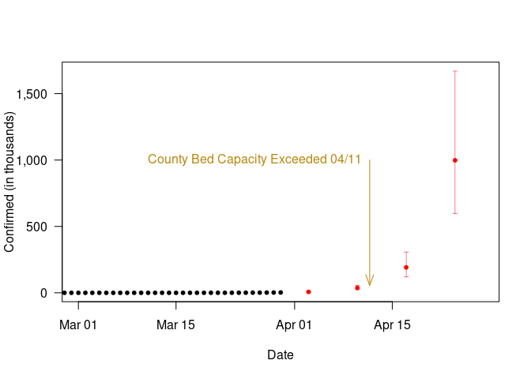

Los Angeles County Covid-19 Analysis
================
Marc Los Huertos
31 March, 2020

# Introduction

As I have watched the Covid-19 pandemic, I decided that I was going to
process the data on my own and see of I could confirm trends articulated
by state and federal agencies. From what I can tell, each region has
it’s own timeline and trajectory based municipal responses and state
mandates. Thus, I took some time to drill into the LA context.

## Disclaimer

This is not peer reviewed work and well outside my typical professional
work – but these mussings are mostly to help me understand what’s going
on, but if others find this useful, please analyze the data for yourself
to confirm my results. If you found something amiss with my analyses,
please let me know and I’ll fix it ASAP.

# Data Source

I have been using the [data hosted on
github](https://github.com/CSSEGISandData/COVID-19), entitled Novel
Corona-virus (COVID-19) Cases and provided by Johns Hopkins University,
Center for Systems Science and Engineering.

# Work flow

First, I create a list of daily reports and combined them into a single
csv. Unfortunately, the folks curating the data have been terribly
inconsistent in the with their data records as columns are added and
inconsistently named. Unfortunately, reading the data into R took 5
hours because there were at least three different file structures, but
should have taken 5 minutes.

# Subset Southern California

I have only selected for Los Angeles so far, but the data is a mess
because Los Angeles disappears for a week, so I had to make a decision
about what to do about missing data – at a key time\! For two weeks the
values seem to be missing. I will need to work on figuring out why.

The numbers creep up slowly in February – as we can see when we limit
the y-axis values. 

And suddenly, we are missing data at the key period of time in the
second week of March. I would hesitate to interpolate the missing data
because as we’ll see in the next section, how the slope is calculated
has extreme effects on the double rate.


## Using LA County Public Health Data

I found press releases by the County to have some of the missing data:

  - 3/09/2020 = 16 cases (github reported 14)
  - 3/10/2020 = 17 cases, but missing LB and Pasadena
  - 3/11/2020 = 27 cases
  - 3/12/2020 = 32 cases
  - 3/13/2020 = 40 cases
  - 3/14/2020 = 53 cases
  - 3/15/2020 = 69 cases
  - 3/16/2020 = 94 cases
  - 3/17/2020 = 144 cases
  - 3/18/2020 = 190 cases
  - 3/19/2020 = 231 cases
  - 3/20/2020 = 292 cases
  - 3/21/2020 = 351 cases
  - 3/22/2020 = 409 cases (corrected as 407 on the 23rd, same as github)
  - 3/23/2020 = 536 cases (90 hospitalized) same as github

Missing or incorrect data on Github site from the weekend of the 28/29
based on the County Health Department Webpage (noon on each day).

``` r
LA$Confirmed[LA$Date=="2020-03-28"] = 1829
LA$Confirmed[LA$Date=="2020-03-29"] = 2136
```


# Determine Doubling Rate

Doubling rate is an estimate of how many days (in this case) we have
seen the confirmed cases double.

The analysis is based on the slope of the natural log of the confirmed
cases and the slope.

But the slope depends on how the early part of the record is included,
which is then also sensitive to the missing data – which is why I
manually entered the data from the County’s advisories.

In this case, I used both the complete data and the data that skips the
first 32 observations. Notice how much better the second line (dark red)
fits the more recent records compared to the purple line that includes
all the data.

One could argue that there was too much uncertainty even in the first
week of March to include in the model, however, I think it’s useful to
include because it’s sets a better stage in how policy makers must
respond in spite of uncertainty.

As it turns out the first 31 days there is only one confirmed infection
– so, it’s better to start when we have an actual change, and on day
32, there were 7 infections.

Using the r<sup>2</sup> to evaluate the models, we find the model that
uses all the data has a r<sup>2</sup> of 0.825, while the regression
that excludes the early part of the dataset has an r<sup>2</sup> of
0.991. The closer to one is the better and these results reinforce my
decision to exclude the early part of the dataset.

If we include the entire data set, the doubling rate is 4.8. Meanwhile,
the doubling rate for the data that excludes the early part of the
record is 2.9, which is probably more consistent with the pattern of
this epidemic.


# Policy Lag Times

Seems to me that we are about two weeks behind in making decisions to
protect public health. The Governor’s order to stay home was made on the
March 19th, thus we should see the same trend in growth until the
effects of the order slow the spread of the virus, which should be about
the 3rd of April, when we should see a decline of the doubling rate.


Based on this, I estimate that on the 3rd of April the County will have
had 7040 confirmed cases.

And here’s how these predictions have changed as I have included more
data:

  - March 25th 6170
  - March 26th 6620
  - March 27th 6810
  - March 28th 7230
  - March 29th 7190

\*Weekend values are not updated on github site for LA County. Thus, I
have used LA County health updates to fill in on weekends.

## Changes in Doubling Rate

How quickly the doubling rate will decrease is anyone’s guess, but I
suspect it will have a lot to do with how effective the shelter in place
is. At this point, I suspect it will be uneven.

At some point, I might want to create windows (perhaps, weekly) to see
how doubling rates change as the pandemic develops.

# Hospital and ICU Capacity

We have about 2.1 beds per 1,000 people in the state of California. With
approximately 10.6 million residents in LA County, there should be
approximately 22260 beds in the county. However, they are not sitting
around empty. In normal times there is a 50% occupancy rate. There is no
reason to believe this is a normal time, and to guess if that rate is
higher or lower is anyone’s guess. Nevertheless, for the sake exploring
the implications, let’s estimate the number of empty beds in LA County
based on these assumptions and 11130 beds exists in LA County.

Based on some WHO estimates, let’s assume about 20% of the confirmed
cases need hospital beds, then LA County will run out of beds on 04/11.
However, what this model is missing is the category of ‘recovered’. It’s
safe to say that after 20 days of being hospitalized patients will
either be in recovery (and can go home) or have died. At this point, I
haven’t included this in the model, thus this prediction is a worst case
scenario.

According to the LA Times, there are roughly 200 ICU beds in the county.
I think about 5% of these who get sick need access to ICU. I suspect
this is going to be an even more serious issue, but I haven’t had time
to model this yet.

<!-- -->

# Testing for an Nonlinear Growth Rate

In theory the US travel and shelter-at-home restrictions should reduce
the rate so spread. I wonder when we’ll start to see that signal? In
other words, we do the values fall outside the expected range? And when
they do, can we model how the rate of transmission is changing?

For example, Los Angeles reported a value of 1818 on the 28th of March.
Was this within my confidence intervals?

With this simple analysis, I obtained the following results:

    ##         Date Confirmed logConfirmed      lwr      upr
    ## 1 2020-03-29      2136      7.66669 7.548748 7.811661

Based on this, I suspect we are still well within the model expectations
and there is no hint of flattening.
