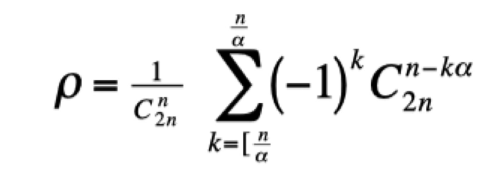

```{r setup, include=FALSE}
knitr::opts_chunk$set(echo = TRUE)
```

## The Equation



p = 1/(C^n(2n))Sum a/n k=n/a (-1)^k C2^(n-ka)2n

The ballistic coefficient,, C, defined as weight. over diameter squared (W/d2) is a constant.K -drag coefficient,

```{r cars}
summary(cars)
```

## Including Plots

You can also embed plots, for example:

```{r pressure, echo=FALSE}
plot(pressure)
```

Note that the `echo = FALSE` parameter was added to the code chunk to prevent printing of the R code that generated the plot.
