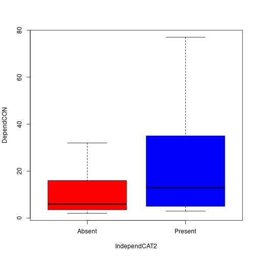

4 Statistical Frameworks
========================================================
author: Marc Los Huertos
date: Nov. 6, 2019
autosize: true
font-family: 'Helvetica'
Science and Method
=======================================================

What is the Scientific Method?
- Make Observations
- Articulate Hypothesis
- Collect Data
- Confront Hypothesis with Data (or Confront Data with Models)
- Interpret Results
- Create New Hypotheses

How do we confront a hypothesis?
========================================================

There are several methods -- We will begin with the popular "frequentists" approach:

Articulate a Null hypothesis (expectation if patterns don't exists, if processes are random...); where altnerative hypothesis suggest a pattern that is non-random.

Test the Null. If we reject, then it leads to....??

An Example of a Null Hypothesis
=======================================================


```r
set.seed(123)
randomdata <-round(rnorm(10, 0, 1), 1); randomdata
```

```
 [1] -0.6 -0.2  1.6  0.1  0.1  1.7  0.5 -1.3 -0.7 -0.4
```

Displaying the Data
===========================================================

```r
hist(randomdata)
```


Question: Is a value >=2 within the random variation?  

Assuming a Probability Distrbution
=================================================


Density Plot and a "Theoretical Distribition"
=================================================


The blue area has 0.98, so the ungrayed has an area of 0.02.
Is this a statistical rarity? 


"The Matrix" of Variable Types
========================================================

- Predictors -- Categorical OR Continuous
- Response -- Categorical OR Continusous

Creating Some Vectors
========================================================


```r
IndependCAT = c(0, 1, 0, 1, 0, 1, 0, 1, 1, 1, 1, 1, 1, 1, 0, 0, 1, 1, 0, 1, 1, 0)
IndependMult = c("A", "B", "C", "A", "B", "C", "A", "B", "C", "A", "B", "A", "C", "B", "A", "B", "C", "A", "B", "A", "B", "C")
DependCAT =   c(T,  F, T, F, T, F, T,  F,  T,  F,  T,  F,  T,  F, T,  F, F, F, T, F, F, T)
IndependCON = c(55, 3, 5, 2, 7, 8, 40, 12, 51, 10, 28, 31, 43, 6, 11, 2, 12, 13, 46, 32, 19, 68)
DependCON = c(2, 4, 2, 5, 6, 14, 23, 21, 42, 12, 45, 35, 77, 4, 5, 6, 3, 6, 9, 11, 22, 32)
```

Converting 1s and 0s to Absent and Present
========================================================


```r
IndependCAT2 <- NULL
IndependCAT2[IndependCAT==0] <- "Absent"
IndependCAT2[IndependCAT==1] <- "Present"
IndependCAT2
```

```
 [1] "Absent"  "Present" "Absent"  "Present" "Absent"  "Present" "Absent" 
 [8] "Present" "Present" "Present" "Present" "Present" "Present" "Present"
[15] "Absent"  "Absent"  "Present" "Present" "Absent"  "Present" "Present"
[22] "Absent" 
```
Checking Vectors -- Do each have the same length?
========================================================


```r
length(DependCAT); length(DependCON); length(IndependCAT); length(IndependCON); length(IndependCAT2)
```

```
[1] 22
```

```
[1] 22
```

```
[1] 22
```

```
[1] 22
```

```
[1] 22
```


Yup!

Predictor = Categorical, Response = Categorical
=======================================================

```
         IndependCAT2
DependCAT Absent Present
    FALSE      1      11
    TRUE       7       3
```

```

	Pearson's Chi-squared test with Yates' continuity correction

data:  DependCAT and IndependCAT2
X-squared = 6.4969, df = 1, p-value = 0.01081
```

Predictor = Categorical, Response = Continuous 
======================================================
left: 30%

***

```r
t.test(DependCON ~ IndependCAT2)
```

```

	Welch Two Sample t-test

data:  DependCON by IndependCAT2
t = -1.5751, df = 19.881, p-value = 0.131
alternative hypothesis: true difference in means is not equal to 0
95 percent confidence interval:
 -25.282866   3.532866
sample estimates:
 mean in group Absent mean in group Present 
               10.625                21.500 
```

```r
summary(aov(DependCON ~ IndependMult))
```

```
             Df Sum Sq Mean Sq F value Pr(>F)
IndependMult  2    980   490.2   1.451  0.259
Residuals    19   6417   337.7               
```

Predictor = Continuous, Response = Continuous 
======================================================
left: 25%

```r
plot(DependCON ~ IndependCON, las=1)
abline(coef(lm(DependCON ~ IndependCON)), col="red", lwd=3)
```


***
DependCON = f(IndependCON) or 

DependCON ~ IndpendCON

```
             Estimate Std. Error  t value   Pr(>|t|)
(Intercept) 6.1624480   5.401249 1.140930 0.26737713
IndependCON 0.4968773   0.179978 2.760766 0.01205716
```
where the slope is 0.5 and an intercept of 6.2 with an r^2 of 0.276.


Predictor = Continuous, Response = Categorical 
======================================================

```r
plot(DependCAT ~ IndependCON, xlim=c(-10,80), ylim=c(-1, 2))
abline(coef(lm(DependCAT ~ IndependCON)), col="orange", lwd=3)
```


Predictor = Continuous, Response = Categorical 
======================================================

```r
glm.out <- glm(DependCAT ~ IndependCON, family=binomial(link='logit'))
summary(glm.out)$coefficients
```

```
               Estimate Std. Error   z value   Pr(>|z|)
(Intercept) -1.98607062 0.87971603 -2.257627 0.02396893
IndependCON  0.08165488 0.03459519  2.360296 0.01826036
```

Predictor = Continuous, Response = Categorical 
======================================================


```
  IndependCON Prob
1           5 0.17
2          30 0.61
3          40 0.78
```


