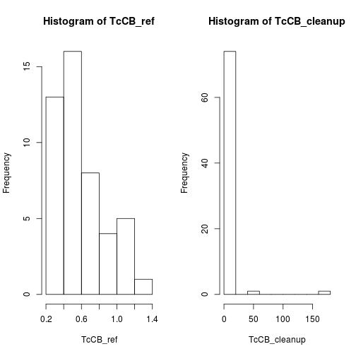
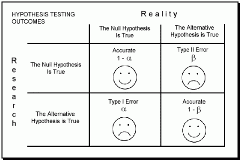
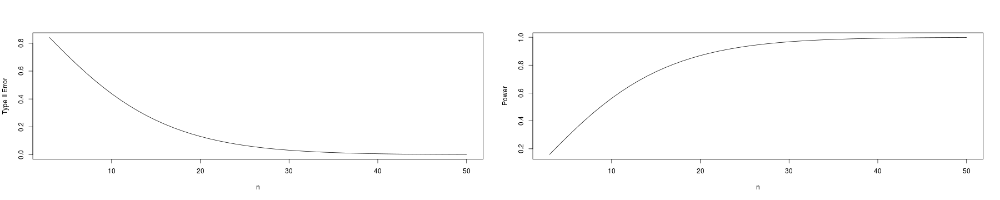

Alpha, Beta, and the t-test
========================================================
author: 
date: Oct. 14th
autosize: true

Coverage
========================================================

Goals for Today

- Experimental Design -- How do we know?
- Review confidence intervals
- t.test()
- Type I and II Errors
- Power and n

How do we know if a hazardous site has been cleaned up?
===================================================

- Sample Soils
    - Depth
    - Random sampling, e.g. gridded, random, etc.
- Link to ecological outcomes
- Link to fate of pollutants (fate in water/air)


- What is clean?

    - Compared to "clean soils" unimpacted, local...

- 95% confidence intervals

- Determine power before analyzing data


Characteristics of Confidence Intervals
========================================================

Confidence intervals rely on three properties: validity, optimality, and invariance. When these properties are met, then the assumptions for the methods hold and the confidence intervals are thought to be more reliable. 

Validity
===================================================

- Validity means that the nominal coverage probability (confidence level) of the confidence interval should hold, either exactly or to a good approximation.

- Optimality means that the rule for constructing the confidence interval should make as much use of the information in the data-set as possible. 

For example, one could throw away half of a dataset and still be able to derive a valid confidence interval. One way of assessing optimality is by the length of the interval, so that a rule for constructing a confidence interval is judged better than another if it leads to intervals whose lengths are typically shorter.
	
- Invariance: In many applications the quantity being estimated might not be tightly defined as such. 

For example, a survey might result in an estimate of the median income in a population, but it might equally be considered as providing an estimate of the logarithm of the median income, given that this is a common scale for presenting graphical results. It would be desirable that the method used for constructing a confidence interval for the median income would give equivalent results when applied to constructing a confidence interval for the logarithm of the median income: Specifically the values at the ends of the transformed interval would be the logarithms of the values at the ends of untransformed interval.
	
Toxic Clean Up Site
=======================================

```r
TcCB_ref <- c(0.60, 0.50, 0.39, 0.84, 0.46, 0.39, 0.62, 0.67, 
0.69, 0.81, 0.38, 0.79, 0.43, 0.57, 0.74, 0.27, 0.51, 
0.35, 0.28, 0.45, 0.42, 1.14, 0.23, 0.72, 0.63, 0.50, 
0.29, 0.82, 0.54, 1.13, 0.56, 1.33, 0.56, 1.11, 0.57, 
0.89, 0.28, 1.20, 0.76, 0.26, 0.34, 0.52, 0.42, 0.22, 
0.33, 1.14, 0.48)

TcCB_cleanup <- c(NA, 0.09, 0.09, 0.12, 0.12, 0.14, 0.16, 
0.17, 0.17, 0.17, 0.18, 0.19, 0.20, 0.20, 
0.21, 0.21, 0.22, 0.22, 0.22, 0.23, 0.24, 
0.25, 0.25, 0.25, 0.25, 0.26, 0.28, 0.28, 
0.29, 0.31, 0.33, 0.33, 0.33, 0.34, 0.37,
0.38, 0.39, 0.40, 0.43, 0.43, 0.47, 0.48, 
0.48, 0.49, 0.51, 0.51, 0.54, 0.50, 0.61,
0.62, 0.75, 0.82, 0.85, 0.92, 0.94, 1.05,
1.10, 1.10, 1.19, 1.22, 1.33, 1.39, 1.39,
1.52, 1.53, 1.73, 2.35, 2.26, 2.59, 2.61,
3.06, 3.29,5.56, 6.61, 18.40, 51.97, 168.64)
```

Distribution
==========================================

```r
# fig.height=3, fig.width=15
par(mfrow=c(1,2))
hist(TcCB_ref)
hist(TcCB_cleanup)
```



Criteria (\( alpha \)) and Confidence Intervals
=====================================

```r
alpha = 0.05
TcCB_ref_mean=mean(TcCB_ref)
TcCB_cleanup_mean = mean(TcCB_cleanup, na.rm=T)

degfree = length(TcCB_ref) - 1
qt(alpha/2, degfree)
```

```
[1] -2.012896
```

```r
CI.low  <- TcCB_ref_mean - qt(alpha/2, degfree)*sd(TcCB_ref)/sqrt(length(TcCB_ref)); CI.low
```

```
[1] 0.6817907
```

```r
CI.high <- TcCB_ref_mean - qt(1-alpha/2, degfree)*sd(TcCB_ref)/sqrt(length(TcCB_ref)); CI.high
```

```
[1] 0.5152306
```

Confidence Intervals as a Hypotheis Test
========================================================


Null Hypothesis Testing?
==================================================

The null hypothesis, there is no difference between the reference site and the clean up site, can be rejected if the p-value if below the criterion, $\alpha$ = 0.05. In this case the p-value was 0.15 thus, the null hypothesis could not be rejected.


```r
t.test(TcCB_ref, TcCB_cleanup)$p.value
```

```
[1] 0.1497826
```

What is our decision was in error or a mistake?
===============================================
Errors (Mistakes) in statistics are probabilities that we can estimate! 

How many mistakes exists in this example?

Type I and II Errors (Mistakes)
=============================================



Type II Error (Mistake) (\(Beta\)) 
===============================================


```r
library(pwr)

n = seq(3,50); d=1; alpha=.05
power = pwr.t2n.test(n1=n, n2=n, d=d, sig.level=alpha)
power$beta = -(power$power-1)
par(mfrow=c(1,2))
plot(n, power$beta, ty='l', ylab="Type II Error")
plot(n, power$power, ty='l', ylab="Power")
```



Power for Clean up Site
==============================================

```r
t.test(TcCB_ref, TcCB_cleanup)
```

```

	Welch Two Sample t-test

data:  TcCB_ref and TcCB_cleanup
t = -1.4552, df = 75.048, p-value = 0.1498
alternative hypothesis: true difference in means is not equal to 0
95 percent confidence interval:
 -7.966888  1.240752
sample estimates:
mean of x mean of y 
0.5985106 3.9615789 
```

```r
# Effect size = (mu1 - mu2) / sd
#d = (TcCB_ref_mean - TcCB_cleanup_mean)/sd(c(TcCB_ref, TcCB_cleanup), na.rm=T); d

pwr.t2n.test(n1=length(TcCB_ref), n2=length(TcCB_cleanup), d, alpha)
```

```

     t test power calculation 

             n1 = 47
             n2 = 77
              d = 1
      sig.level = 0.05
          power = 0.9996624
    alternative = two.sided
```

Power for Clean up Site -- One Tailed
===========================================

```r
pwr.t2n.test(n1=length(TcCB_ref), n2=length(TcCB_cleanup), d, alpha, alternative="less")
```

```

     t test power calculation 

             n1 = 47
             n2 = 77
              d = 1
      sig.level = 0.05
          power = 1.133316e-12
    alternative = less
```


Type I and II Error (Mistakes) Probabilities 
==============================================

